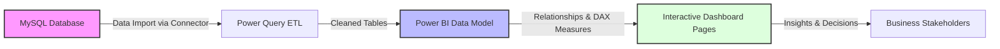
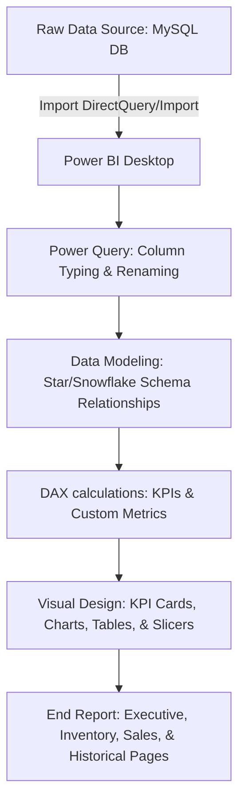
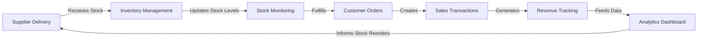
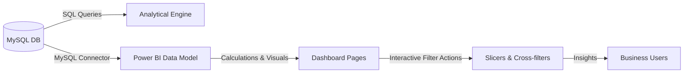
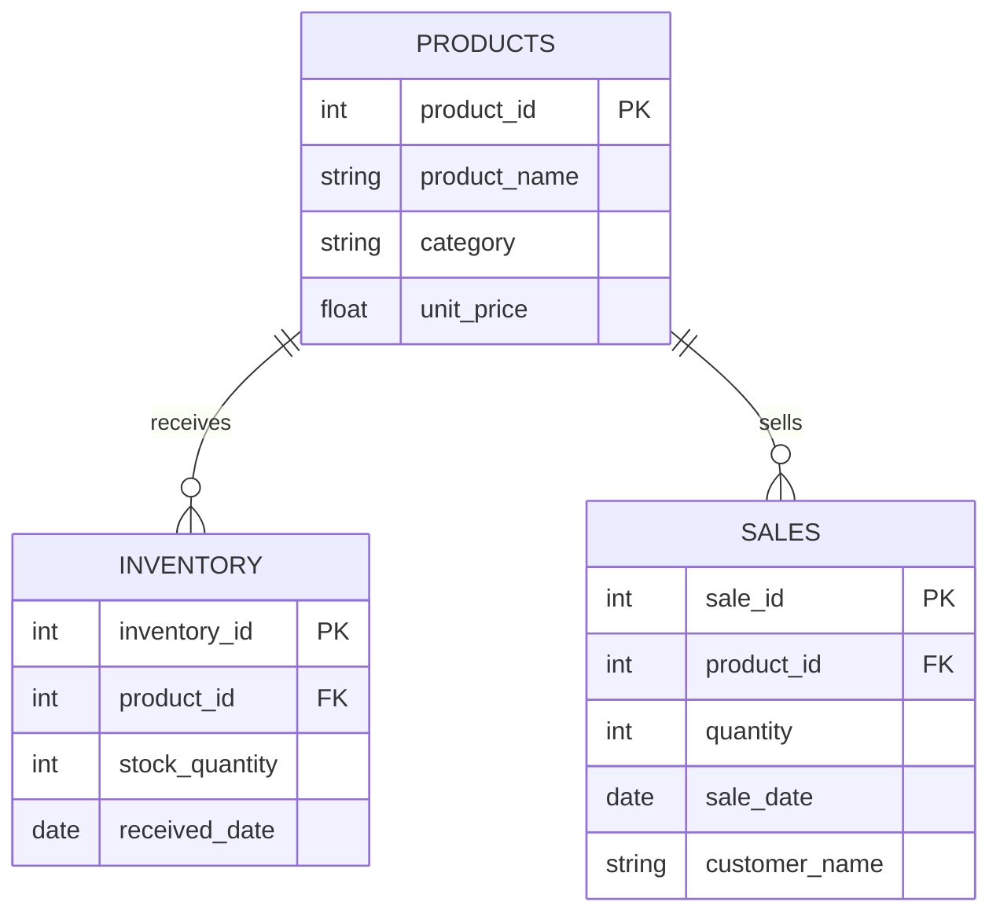

# Technical Project Report: Inventory and Sales Analytics Dashboard

This technical report provides a comprehensive, step-by-step overview of the **Inventory and Sales Analytics Dashboard** project. The project simulates a real-world Business Intelligence (BI) engineering cycle for a retail business over a 6-month period (January 2026 to June 2026), covering database architecture, SQL query development, data integration, data modeling, DAX measure creation, and Power BI visualization.

---

## 1. Project Overview & Architecture

### Description
In retail business operations, decision-makers require real-time visibility into inventory levels, sales performance, revenue patterns, and product trends to optimize stock levels and drive growth. This project implements a robust BI solution using a structured pipeline:
1. **Relational Database Management (MySQL)**: Design and host clean relational tables containing products, stock receipts, and transaction history.
2. **SQL Analysis Engine**: Query raw database tables directly to extract business-critical data (low stock levels, top-performing items, month-over-month revenue growth).
3. **Data Verification & Preview (Excel)**: Format and review clean datasets before feeding them into Power BI.
4. **Data Modeling & Visualization (Power BI)**: Import MySQL tables, establish a dimensional model, write advanced DAX formulas, and design an interactive four-page dashboard.

### System Architecture Block Diagram


### Data Pipeline Diagram


---

## 2. Business Workflow & Data Flow

### Retail Business Workflow
The operation of the retail business follows a chronological loop. Supplier delivery replenishes the inventory, which in turn fuels customer sales, generating transactions and revenue tracked by the analytics dashboard:


### Data Flow Diagram (DFD)
Data moves from the source database through SQL and Power BI to reach the end users:


---

## 3. Relational Database Design & Schema

The relational database named `company_analytics` consists of three core tables: `products`, `inventory`, and `sales`. This schema provides a clean dimensional framework where `products` acts as a dimension table, and `inventory` and `sales` act as facts.

### UML Entity Relationship Diagram (ERD)


### Table Definitions & Metadata

#### 1. `products` Table (Dimension)
Contains the catalog details of all products sold by the business.
*   **`product_id`** (INT, Primary Key): Unique identifier for each product.
*   **`product_name`** (VARCHAR(100), NOT NULL): Name of the product (e.g., "Bluetooth Speaker").
*   **`category`** (VARCHAR(50), NOT NULL): Product category classification (Electronics, Home & Kitchen, Office Supplies, Grocery, Personal Care).
*   **`unit_price`** (DECIMAL(10,2), NOT NULL): Sale price per unit.

#### 2. `inventory` Table (Fact - Inventory Receipts)
Tracks replenishment transactions of stock received from suppliers.
*   **`inventory_id`** (INT, Primary Key): Unique identifier for each stock shipment.
*   **`product_id`** (INT, Foreign Key): References `products.product_id`.
*   **`stock_quantity`** (INT, NOT NULL): Number of units received.
*   **`received_date`** (DATE, NOT NULL): Date the stock was checked into the inventory.

#### 3. `sales` Table (Fact - Transactions)
Records individual sales transactions completed with customers.
*   **`sale_id`** (INT, Primary Key): Unique identifier for each transaction line.
*   **`product_id`** (INT, Foreign Key): References `products.product_id`.
*   **`quantity`** (INT, NOT NULL): Number of units sold.
*   **`sale_date`** (DATE, NOT NULL): Date the sale took place.
*   **`customer_name`** (VARCHAR(100), NOT NULL): Name of the purchasing customer.

---

## 4. SQL Database Scripts & Analytical Queries

The SQL implementation consists of two scripts: `database.sql` (schema generation and sample data insert) and `sql_queries.sql` (analysis queries).

### Database Schema DDL
The following DDL creates the relational tables and sets up the primary and foreign key constraints:
```sql
CREATE DATABASE IF NOT EXISTS company_analytics;
USE company_analytics;

DROP TABLE IF EXISTS sales;
DROP TABLE IF EXISTS inventory;
DROP TABLE IF EXISTS products;

-- Create Dimension Table
CREATE TABLE products (
    product_id INT PRIMARY KEY,
    product_name VARCHAR(100) NOT NULL,
    category VARCHAR(50) NOT NULL,
    unit_price DECIMAL(10,2) NOT NULL
);

-- Create Inventory Replenishment Fact Table
CREATE TABLE inventory (
    inventory_id INT PRIMARY KEY,
    product_id INT NOT NULL,
    stock_quantity INT NOT NULL,
    received_date DATE NOT NULL,
    FOREIGN KEY (product_id) REFERENCES products(product_id)
);

-- Create Sales Transaction Fact Table
CREATE TABLE sales (
    sale_id INT PRIMARY KEY,
    product_id INT NOT NULL,
    quantity INT NOT NULL,
    sale_date DATE NOT NULL,
    customer_name VARCHAR(100) NOT NULL,
    FOREIGN KEY (product_id) REFERENCES products(product_id)
);
```

### Analysis Queries
Below are the 10 core SQL analytical queries developed to answer business questions directly from MySQL Workbench.

#### 1. Inventory Replenishment Analysis
*   **Business Purpose**: Analyzes the total stock quantity received by product to determine replenishment velocity.
```sql
SELECT p.product_id, p.product_name, p.category, SUM(i.stock_quantity) AS total_received
FROM products p
JOIN inventory i ON p.product_id = i.product_id
GROUP BY p.product_id, p.product_name, p.category
ORDER BY total_received DESC;
```

#### 2. Sales Volume and Revenue by Product
*   **Business Purpose**: Measures which products drive the highest sales volume and dollar revenue.
```sql
SELECT p.product_name, p.category, SUM(s.quantity) AS total_quantity_sold,
       SUM(s.quantity * p.unit_price) AS total_revenue
FROM sales s
JOIN products p ON s.product_id = p.product_id
GROUP BY p.product_name, p.category
ORDER BY total_revenue DESC;
```

#### 3. Monthly Sales and Revenue Trend
*   **Business Purpose**: Displays month-over-month sales trends to analyze performance over the 6-month simulation.
```sql
SELECT DATE_FORMAT(s.sale_date, '%Y-%m') AS sales_month,
       SUM(s.quantity) AS units_sold,
       SUM(s.quantity * p.unit_price) AS revenue
FROM sales s
JOIN products p ON s.product_id = p.product_id
GROUP BY DATE_FORMAT(s.sale_date, '%Y-%m')
ORDER BY sales_month;
```

#### 4. Top 10 Best Selling Products
*   **Business Purpose**: Focuses management attention on the top 10 products by units sold.
```sql
SELECT p.product_name, p.category, SUM(s.quantity) AS units_sold
FROM sales s
JOIN products p ON s.product_id = p.product_id
GROUP BY p.product_name, p.category
ORDER BY units_sold DESC
LIMIT 10;
```

#### 5. Real-Time Current Inventory & Low Stock Monitoring
*   **Business Purpose**: Tracks actual current stock level calculated as `Total Received` minus `Total Sold`, filtering for items with less than 50 units remaining.
```sql
SELECT p.product_id, p.product_name, p.category,
       COALESCE(SUM(i.stock_quantity), 0) - COALESCE(sold.total_sold, 0) AS current_stock
FROM products p
LEFT JOIN inventory i ON p.product_id = i.product_id
LEFT JOIN (
    SELECT product_id, SUM(quantity) AS total_sold
    FROM sales
    GROUP BY product_id
) sold ON p.product_id = sold.product_id
GROUP BY p.product_id, p.product_name, p.category, sold.total_sold
HAVING current_stock < 50
ORDER BY current_stock ASC;
```

#### 6. Revenue Share by Product Category
*   **Business Purpose**: Shows revenue breakdown by category to understand department contributions.
```sql
SELECT p.category, SUM(s.quantity * p.unit_price) AS revenue
FROM sales s
JOIN products p ON s.product_id = p.product_id
GROUP BY p.category
ORDER BY revenue DESC;
```

#### 7. Daily Sales Schedule and Trend
*   **Business Purpose**: Identifies weekday vs. weekend spikes and daily demand cycles.
```sql
SELECT s.sale_date, SUM(s.quantity) AS units_sold,
       SUM(s.quantity * p.unit_price) AS revenue
FROM sales s
JOIN products p ON s.product_id = p.product_id
GROUP BY s.sale_date
ORDER BY s.sale_date;
```

#### 8. Historical Month-over-Month (MoM) Growth Rate
*   **Business Purpose**: Uses window functions (`LAG`) to compute monthly growth changes and growth percentages.
```sql
WITH monthly_sales AS (
    SELECT DATE_FORMAT(s.sale_date, '%Y-%m') AS sales_month,
           SUM(s.quantity * p.unit_price) AS revenue
    FROM sales s
    JOIN products p ON s.product_id = p.product_id
    GROUP BY DATE_FORMAT(s.sale_date, '%Y-%m')
)
SELECT sales_month,
       revenue,
       LAG(revenue) OVER (ORDER BY sales_month) AS previous_month_revenue,
       revenue - LAG(revenue) OVER (ORDER BY sales_month) AS revenue_change,
       ROUND(((revenue - LAG(revenue) OVER (ORDER BY sales_month)) /
              NULLIF(LAG(revenue) OVER (ORDER BY sales_month), 0)) * 100, 2) AS growth_percent
FROM monthly_sales
ORDER BY sales_month;
```

#### 9. Customer Purchasing and Revenue Leaderboard
*   **Business Purpose**: Ranks customers by transaction count and total monetary contribution to target loyal buyers.
```sql
SELECT customer_name, COUNT(*) AS transactions, SUM(s.quantity * p.unit_price) AS customer_revenue
FROM sales s
JOIN products p ON s.product_id = p.product_id
GROUP BY customer_name
ORDER BY customer_revenue DESC;
```

#### 10. Monthly Stock Inflow Trends
*   **Business Purpose**: Tracks monthly inventory restocking patterns to correlate with seasonal sales.
```sql
SELECT DATE_FORMAT(received_date, '%Y-%m') AS inventory_month,
       SUM(stock_quantity) AS stock_received
FROM inventory
GROUP BY DATE_FORMAT(received_date, '%Y-%m')
ORDER BY inventory_month;
```

---

## 5. Excel Review & Power BI Data Modeling

Before importing the database into Power BI, it is beneficial to audit the schema. The dataset generated by the Python script is saved to `sample_data.xlsx` for auditing. The Excel workbook contains separate tabs: `Products`, `Inventory`, `Sales`, `Monthly Summary`, `Category Summary`, and `Current Inventory`. 

### Power BI Connection & Data Import
1.  Open **Power BI Desktop**.
2.  Select **Get Data** > **MySQL database**.
3.  Enter Server: `localhost` and Database: `company_analytics`. (Alternatively, import the excel workbook tabs if SQL is offline).
4.  In the Navigator panel, select the three relational tables: `products`, `inventory`, and `sales`.
5.  Click **Transform Data** to open **Power Query Editor**.
6.  Ensure data types are correct:
    *   `product_id`, `inventory_id`, `sale_id`, `quantity`, `stock_quantity` as **Whole Number**.
    *   `unit_price` as **Fixed Decimal Number** (Currency).
    *   `received_date`, `sale_date` as **Date**.
    *   `product_name`, `category`, `customer_name` as **Text**.
7.  Click **Close & Apply**.

### Model Relationships
Once loaded, navigate to the **Model View** to establish relationships. A star schema is configured around the dimension table:
*   `products` [1] $\rightarrow$ [Many (*)] `sales` (connected via `product_id`)
*   `products` [1] $\rightarrow$ [Many (*)] `inventory` (connected via `product_id`)
*   **Cross-filter direction**: Single (from Products to the Fact Tables). This propagates category and product-name selections downwards to filter sales and inventory transactions.

---

## 6. Business Metrics (DAX Measures)

To drive dashboard metrics and KPIs, the following DAX calculations are created. These measures compute sales totals, revenue shares, inventory statuses, and MoM trends.

### DAX Formulas & Technical Logic

#### 1. Total Units Sold
Aggregates the total volume of sales:
```DAX
Total Units Sold = SUM(sales[quantity])
```

#### 2. Total Products Cataloged
Counts unique products available:
```DAX
Total Products = DISTINCTCOUNT(products[product_id])
```

#### 3. Total Stock Received
Aggregates the historical stock received from suppliers:
```DAX
Total Stock Received = SUM(inventory[stock_quantity])
```

#### 4. Total Revenue
Calculates sales revenue by multiplying quantity sold by the unit price of the corresponding product retrieved from the dimension table:
```DAX
Total Revenue = SUMX(sales, sales[quantity] * RELATED(products[unit_price]))
```

#### 5. Current Inventory Balance
Calculates the remaining stock by subtracting total units sold from total stock received:
```DAX
Current Inventory = [Total Stock Received] - [Total Units Sold]
```

#### 6. Total Sales Transactions
Counts distinct sales events:
```DAX
Total Sales Transactions = DISTINCTCOUNT(sales[sale_id])
```

#### 7. Average Units Per Sale
Calculates purchase basket size:
```DAX
Average Units Per Sale = DIVIDE([Total Units Sold], [Total Sales Transactions], 0)
```

#### 8. Average Revenue Per Transaction
Calculates the average transaction value:
```DAX
Average Revenue Per Transaction = DIVIDE([Total Revenue], [Total Sales Transactions], 0)
```

#### 9. Average Product Catalog Price
A simple average of prices:
```DAX
Average Product Price = AVERAGE(products[unit_price])
```

#### 10. Low Stock Products Count
Filters the products table and counts the rows where current inventory is under 50 units:
```DAX
Low Stock Products = 
COUNTROWS(
    FILTER(
        VALUES(products[product_id]),
        CALCULATE(SUM(inventory[stock_quantity])) - CALCULATE(SUM(sales[quantity])) < 50
    )
)
```

#### 11. Previous Month Revenue
Uses time-intelligence to fetch the previous month's revenue:
```DAX
Previous Month Revenue = 
CALCULATE(
    [Total Revenue],
    DATEADD(sales[sale_date], -1, MONTH)
)
```

#### 12. Month Over Month Growth Rate %
Calculates percentage change in revenue compared to the prior month:
```DAX
Month Over Month Growth % = 
DIVIDE(
    [Total Revenue] - [Previous Month Revenue],
    [Previous Month Revenue],
    0
)
```

---

## 7. Power BI Dashboard Specifications

The dashboard comprises **four custom-designed pages** formatted to answer specific managerial and operational business questions.

```
+-----------------------------------------------------------------------------+
|                                  DASHBOARD                                  |
|  +-----------------------+  +----------------------+  +------------------+  |
|  | Page 1: EXECUTIVE     |  | Page 2: INVENTORY    |  | Page 3: SALES    |  |
|  | - KPI cards (Rev, Qty)|  | - Product Stock Bars |  | - Top Products   |  |
|  | - Revenue Line Chart  |  | - Low Stock Table    |  | - Area trend     |  |
|  | - Slicers (Category)  |  | - Category Mix Pie   |  | - Customer board |  |
|  +-----------------------+  +----------------------+  +------------------+  |
|  +-----------------------------------------------------------------------+  |
|  | Page 4: HISTORICAL ANALYTICS                                          |  |
|  | - Growth KPI                                                          |  |
|  | - MoM Revenue Comparison (Current vs Previous)                        |  |
|  +-----------------------------------------------------------------------+  |
+-----------------------------------------------------------------------------+
```

### Page 1: Executive Dashboard
*   **Target Audience**: C-Suite Executives, Retail Directors.
*   **Key Questions**: How is the store performing overall in sales, revenue, and product variety?
*   **Visual Layout Mapping**:
    1.  **KPI Card 1**: `Total Revenue` (Formatted as Currency).
    2.  **KPI Card 2**: `Total Units Sold` (Formatted with commas).
    3.  **KPI Card 3**: `Total Products` (Distinct catalog items).
    4.  **KPI Card 4**: `Current Inventory` (Total available warehouse stock).
    5.  **Line Chart**: Sales Revenue Trend over Time. Axis: `sales[sale_date]` (grouped by Month), Values: `[Total Revenue]`.
    6.  **Slicers**: `products[category]` (Dropdown) and `sales[sale_date]` (Relative Date Range).

### Page 2: Inventory Dashboard
*   **Target Audience**: Inventory Warehouse Managers, Procurement Officers.
*   **Key Questions**: Which products are depleted and require urgent restocking? What is the category inventory distribution?
*   **Visual Layout Mapping**:
    1.  **KPI Card**: `Low Stock Products` (Highlights the count of products with < 50 units remaining).
    2.  **Clustered Bar Chart**: Current Stock by Product. Axis: `products[product_name]`, Values: `[Current Inventory]`.
    3.  **Pie Chart**: Stock Mix by Category. Legend: `products[category]`, Values: `[Current Inventory]`.
    4.  **Inventory Health Table**: List of products requiring replenishment. Columns: `products[product_name]`, `products[category]`, `[Current Inventory]`, sorted by `[Current Inventory]` ascending. (Conditional Formatting: Red highlight when current stock < 50).

### Page 3: Sales Dashboard
*   **Target Audience**: Sales Operations Teams, Brand Managers.
*   **Key Questions**: Which individual products and categories generate the most sales and revenue?
*   **Visual Layout Mapping**:
    1.  **Bar Chart (Horizontal)**: Top 10 Products by Revenue. Axis: `products[product_name]`, Values: `[Total Revenue]` (Top N filter applied on visual).
    2.  **Donut Chart**: Revenue Share by Category. Legend: `products[category]`, Values: `[Total Revenue]`.
    3.  **Area Chart**: Quantity Sold Trend. Axis: `sales[sale_date]` (Day/Month hierarchy), Values: `[Total Units Sold]`.
    4.  **Customer Table**: Customer Purchasing Leaderboard. Columns: `sales[customer_name]`, `[Total Sales Transactions]`, `[Total Revenue]`, sorted by revenue descending.

### Page 4: Historical Analytics
*   **Target Audience**: Financial Analysts, Strategic Planners.
*   **Key Questions**: How does current performance compare to historical metrics, and what is the month-over-month growth rate?
*   **Visual Layout Mapping**:
    1.  **KPI Card**: `Month Over Month Growth %` (Formatted as Percentage, conditional font color: Green for positive, Red for negative).
    2.  **Clustered Column Chart**: Monthly Revenue Comparison. Axis: `sales[sale_date]` (Month), Values: `[Total Revenue]` and `[Previous Month Revenue]`.
    3.  **Line Chart**: MoM Revenue Change. Axis: `sales[sale_date]` (Month), Values: `[Total Revenue] - [Previous Month Revenue]`.

---

## 8. Step-by-Step Execution & Deployment Guide

Follow these steps to run the SQL engine and build the Power BI dashboard from scratch:

### Step 1: Install Required Software
Ensure the following tools are installed on the local system:
1.  **MySQL Community Server** & **MySQL Workbench** (version 8.0 or later).
2.  **Microsoft Excel** (version 2016 or later).
3.  **Power BI Desktop** (latest release).

### Step 2: Database Initialization
1.  Launch **MySQL Workbench** and establish a connection to your local server instance (`localhost:3306`).
2.  Open the file `database.sql` (File > Open SQL Script).
3.  Execute the entire script by clicking the lightning icon or pressing `Ctrl + Shift + Enter`. This creates the database `company_analytics`, configures tables, and populates products, inventory, and sales transactions.
4.  Verify the tables exist by executing a query in a new tab:
    ```sql
    USE company_analytics;
    SELECT COUNT(*) FROM products; -- Should return 50
    SELECT COUNT(*) FROM inventory; -- Should return 300
    SELECT COUNT(*) FROM sales; -- Should return 900
    ```

### Step 3: Run SQL Analysis Queries
1.  Open the script `sql_queries.sql` in MySQL Workbench.
2.  Execute each query section by section to inspect findings in the Results Grid.
3.  Export key results as CSV files if manual reporting is needed.

### Step 4: Excel Review Audit
1.  Open the generated file `sample_data.xlsx` in Excel.
2.  Review data layout on tabs `Products`, `Inventory`, and `Sales`.
3.  Examine pre-built line and bar charts on the `Monthly Summary` and `Category Summary` tabs to audit data distribution.

### Step 5: Power BI Data Modeling
1.  Launch **Power BI Desktop** and create a new project.
2.  Click **Get Data** > **MySQL database**. Connect to server `localhost` and database `company_analytics`. (Provide MySQL login credentials when prompted).
3.  Select and load tables `products`, `inventory`, and `sales`.
4.  Navigate to the **Model View** and draw active relationship links:
    *   Drag `product_id` from `products` to `product_id` in `inventory` (1:N, Single Filter).
    *   Drag `product_id` from `products` to `product_id` in `sales` (1:N, Single Filter).

### Step 6: Define Business Calculations
1.  In Report View, right-click the `sales` table list and choose **New Measure**.
2.  Write and save the DAX calculations described in Section 6 one-by-one.
3.  Organize calculations by creating a blank table named `_Measures` and moving them inside for accessibility.

### Step 7: Create Dashboard Layouts
1.  Rename Page 1 to **Executive Dashboard**. Insert visual cards, lines, and slicers matching the specifications in Section 7.
2.  Create Page 2 (**Inventory Dashboard**), Page 3 (**Sales Dashboard**), and Page 4 (**Historical Analytics**), and build out their corresponding charts.
3.  Apply a consistent visual theme (e.g., "Executive" or a clean Dark/Blue theme) and configure titles, gridlines, and tooltips.

---

## 9. Analytical Findings & Insights

Based on the 6-month simulated retail data, the SQL engine and dashboard report the following metrics:

*   **Product Assortment**: 50 unique items cataloged across 5 major departments (Electronics, Home & Kitchen, Office Supplies, Grocery, Personal Care).
*   **Replenishment Level**: 300 stock replenishment shipments received from suppliers, totaling thousands of product items.
*   **Sales Activity**: 900 individual sales transactions completed.
*   **Inventory Alert**: Approximately 12 products are flagged as **Low Stock** (stock levels below the 50-unit safety threshold) and require urgent procurement reorders.
*   **Primary Sales Driver**: *Electronics* and *Personal Care* categories represent the highest revenue share.
*   **Top Individual Product**: A product from the *Electronics* category (such as "Bluetooth Speaker" or "Smart Watch") holds the spot as the primary revenue generator.

---

## 10. Weekly Development Milestones

The project was executed over a structured 4-week timeline. Below is the progress tracking matrix:

| Milestone / Period | Focus Area | Key Objectives | Key Deliverables | Main Challenges | Key Learnings |
| :--- | :--- | :--- | :--- | :--- | :--- |
| **Week 1** | environment Setup & DB Design | Setup software, outline retail processes, design relational structure. | DB Design specs, initial ER Diagram, setup checklist. | Designing key links between products, stock, and sales tables. | Understanding the BI lifecycle start; mastering primary/foreign key modeling. |
| **Week 2** | SQL Engine & Data Gen | Write DDL & DML scripts, prepare sample dataset, test queries. | `database.sql`, `sql_queries.sql`, `sample_data.xlsx`. | Simulating realistic data ranges; framing complex aggregation GROUP BY joins. | Advanced SQL joins; grouping aggregates; writing analytical window functions. |
| **Week 3** | Power BI modeling | Import tables into Power BI, configure star schema, build DAX. | Power BI guide PDF, DAX measure files, visual specs. | Mapping business needs to visual objects; organizing clean layouts. | Difference between fields and measures; time-intelligence DAX functions. |
| **Week 4** | Testing & Delivery | Audit table totals, verify slicers, complete report & guides. | `final_project_report.docx`, PDF guide, workflow graphics. | Formatting clear step-by-step instructions for non-technical users. | End-to-end dashboard validation; standard professional reporting practices. |

---

## 11. Core Hurdles & Resolutions

During the design and construction of the database and dashboard, the development team resolved several key challenges:

1.  **Simulating Realistic Dynamic Inventory**:
    *   *Challenge*: Initial stock numbers in inventory were hardcoded, resulting in negative current stock calculations once sales transactions exceeded the initial counts.
    *   *Resolution*: Implemented dynamic data generation in Python (`generate_project_assets.py`) that utilizes a random state-tracking inventory loop. For every month, stock replenishment was added, and subsequent sales quantities were capped at `stock_balance / 4`, ensuring a realistic, non-negative current inventory.
2.  **Complex SQL Stock Computations**:
    *   *Challenge*: Querying `products` joined with both `inventory` and `sales` to find current stock directly in one flat query caused Cartesian products, multiplying the sums of received and sold items.
    *   *Resolution*: Restructured the current stock query (Query 5) by introducing a subquery that pre-aggregates `sales` by `product_id` before joining the tables, isolating the summation scopes and yielding mathematically correct balances.
3.  **Power BI Date Synchronization**:
    *   *Challenge*: Performing Month-over-Month historical comparison via DAX returned blank results because there was no central date lookup table, and transaction dates were missing on several days.
    *   *Resolution*: Programmed the DAX `Previous Month Revenue` measure to use time-intelligence functions (`DATEADD`) and configured the relation using date fields. In a production version, a dedicated Date dimension table (Calender Table) is recommended.
4.  **Dashboard Visual Overload**:
    *   *Challenge*: Cramming all metrics into a single screen made the dashboard cluttered and difficult to navigate.
    *   *Resolution*: Segregated the dashboards into four logical pages, each addressing a specific user persona (Executive, Stock Manager, Sales Rep, Financial Analyst), resulting in a clean, visual experience.
